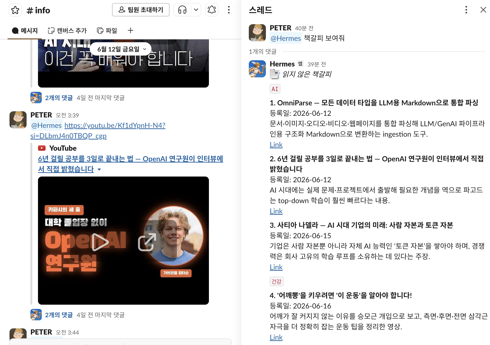

<p align="center">
  
  
  
  
</p>

<h1 align="center">🔖 link-bookmark</h1>
<h3 align="center">채팅 속 링크를 읽지 않은 책갈피로 깔끔하게 정리하는 Hermes Skill</h3>

<p align="center">
  Slack, Discord, Telegram 같은 채팅 채널에 쌓이는 링크를<br/>
  <b>카테고리별 읽지 않은 책갈피</b>로 저장하고 보여줍니다.
</p>

<p align="center">
  No history API required. JSON 기반. 표시 번호는 매번 깔끔하게 1부터.
</p>

<p align="center">
  <a href="./README.en.md"><b>English README</b></a>
</p>

---

<p align="center">
  
</p>

---

## 무엇을 해주나요?

- 채널/프로젝트별 JSON 파일에 링크를 저장합니다.
- 아직 읽지 않은 링크만 보여줍니다.
- 카테고리별로 묶어서 보여줍니다.
- 보여줄 때마다 읽지 않은 항목을 `1..N`으로 다시 번호 매깁니다.
- 내부 JSON의 안정적인 `id`는 유지해서 읽음 처리가 꼬이지 않게 합니다.
- 한국어 `책갈피` 워크플로우와 영어 bookmark 워크플로우를 모두 지원합니다.
- Slack/Discord 히스토리 API가 없어도 동작합니다.

예시 출력:

```md
:bookmark_tabs: *읽지 않은 책갈피*

`AI`

**1. Example AI Tool**  
등록일: 2026-06-16  
A concise summary of the link.  
[Link](https://example.com)
```

## 설치 방법

### 방법 A — Hermes 스킬 폴더에 바로 clone

```bash
mkdir -p ~/.hermes/skills/productivity
git clone https://github.com/PeterCha90/link-bookmark.git ~/.hermes/skills/productivity/link-bookmark
```

설치 후 Hermes를 재시작하거나 새 세션을 시작해야 스킬 로더가 새 스킬을 인식합니다.

### 방법 B — ZIP으로 다운로드

```bash
mkdir -p ~/.hermes/skills/productivity/link-bookmark
curl -L https://github.com/PeterCha90/link-bookmark/archive/refs/heads/main.zip -o /tmp/link-bookmark.zip
python3 - <<'PY'
import zipfile
from pathlib import Path
src = Path('/tmp/link-bookmark.zip')
dst = Path.home() / '.hermes' / 'skills' / 'productivity' / 'link-bookmark'
dst.mkdir(parents=True, exist_ok=True)
with zipfile.ZipFile(src) as z:
    prefix = 'link-bookmark-main/'
    for item in z.infolist():
        if item.is_dir():
            continue
        rel = item.filename.removeprefix(prefix)
        if not rel or rel.startswith('.git'):
            continue
        out = dst / rel
        out.parent.mkdir(parents=True, exist_ok=True)
        out.write_bytes(z.read(item))
PY
```

설치 후 Hermes를 재시작하거나 새 세션을 시작하세요.

## 설치 확인

터미널에서 스킬 파일이 있는지 확인합니다.

```bash
test -f ~/.hermes/skills/productivity/link-bookmark/SKILL.md && echo "installed"
```

Hermes에서 이렇게 물어봐도 됩니다.

```text
책갈피 관련 스킬 뭐 있어?
```

## 첫 책갈피 JSON 만들기

채널/프로젝트별 JSON 파일을 하나 만듭니다. 파일명은 Slack 채널 ID, Discord 채널 ID, 프로젝트명 등 안정적인 context key를 쓰면 됩니다.

```bash
mkdir -p ~/.hermes/link_bookmarks
cp ~/.hermes/skills/productivity/link-bookmark/templates/link_bookmark.example.json ~/.hermes/link_bookmarks/my-channel.json
```

JSON이 유효한지 확인하려면:

```bash
python3 -m json.tool ~/.hermes/link_bookmarks/my-channel.json >/tmp/link-bookmark-check.json
```

Slack에서는 보통 채널 ID를 파일명으로 쓰면 편합니다.

```text
~/.hermes/link_bookmarks/C0123456789.json
```

## Hermes에게 이렇게 요청하세요

```text
책갈피 보여줘
```

```text
이 링크 책갈피에 추가해줘: https://example.com
```

```text
1번, 3번 읽음 처리해줘
```

```text
전부 읽음 처리해줘
```

Hermes는 사용자가 보는 번호를 “현재 읽지 않은 목록의 표시 번호”로 다뤄야 합니다. 안정적인 JSON `id`로 처리해야 할 때만 `raw id` 또는 `by id`라고 명시하세요.

## helper script 사용법

스킬에 포함된 `scripts/link_bookmark.py`는 선택 사항이지만, JSON 조작을 정확하게 하고 싶을 때 유용합니다.

읽지 않은 책갈피 보기:

```bash
python ~/.hermes/skills/productivity/link-bookmark/scripts/link_bookmark.py show ~/.hermes/link_bookmarks/my-channel.json --locale ko
```

영어 출력으로 보기:

```bash
python ~/.hermes/skills/productivity/link-bookmark/scripts/link_bookmark.py show ~/.hermes/link_bookmarks/my-channel.json
```

링크 추가:

```bash
python ~/.hermes/skills/productivity/link-bookmark/scripts/link_bookmark.py add ~/.hermes/link_bookmarks/my-channel.json \
  --title "Example AI Tool" \
  --url "https://example.com" \
  --category "AI·Tools" \
  --summary "A concise summary of the link."
```

표시 번호 기준으로 읽음 처리:

```bash
python ~/.hermes/skills/productivity/link-bookmark/scripts/link_bookmark.py mark-read ~/.hermes/link_bookmarks/my-channel.json 1 3
```

안정적인 JSON ID 기준으로 읽음 처리:

```bash
python ~/.hermes/skills/productivity/link-bookmark/scripts/link_bookmark.py mark-read ~/.hermes/link_bookmarks/my-channel.json --by-id 42
```

## JSON 형식

```json
{
  "channel_id": "example-channel",
  "source": "slack",
  "items": [
    {
      "id": 1,
      "status": "unread",
      "category": "AI·Tools",
      "title": "Example AI Tool",
      "url": "https://example.com",
      "source_type": "web",
      "date": "2026-06-16 09:00",
      "summary": "A concise summary of the link.",
      "key_points": ["First point", "Second point"]
    }
  ],
  "read_items": [],
  "updated_at": "2026-06-16T09:00:00+09:00",
  "notes": "Optional notes."
}
```

### 주요 필드

- `id`: 내부 안정 ID입니다. 한 번 만든 뒤 renumber하지 마세요.
- `status`: `unread` 또는 `read`입니다.
- `category`: 저장할 때는 자세히 써도 됩니다. 출력할 때는 앞부분만 넓은 카테고리로 보여줍니다.
- `date`: 등록일입니다. 출력에서는 `YYYY-MM-DD`만 보여줍니다.
- `read_items`: 읽음 처리된 안정 ID 목록입니다.

## 기존 `link-report`에서 이전하기

기존에 `~/.hermes/link_reports/<channel-id>.json`를 쓰고 있었다면 새 위치로 복사하면 됩니다.

```bash
mkdir -p ~/.hermes/link_bookmarks
cp ~/.hermes/link_reports/<channel-id>.json ~/.hermes/link_bookmarks/<channel-id>.json
```

스키마는 호환됩니다.

## 중요한 동작 규칙

- 책갈피를 보여주는 것만으로는 읽음 처리하지 않습니다.
- 사용자가 명시적으로 요청할 때만 읽음 처리합니다.
- 화면에 보이는 번호는 임시 번호입니다. 읽음 처리 후에는 다시 `1..N`으로 바뀝니다.
- JSON 내부의 안정 ID는 절대 renumber하지 않습니다.
- Slack/Discord 과거 메시지를 자동으로 읽는 기능은 아닙니다. Hermes에 전달된 메시지나 사용자가 직접 준 링크를 기반으로 동작합니다.

## 레포 구조

```text
SKILL.md
README.md
README.en.md
LICENSE
templates/link_bookmark.example.json
scripts/link_bookmark.py
```

## 라이선스

MIT
